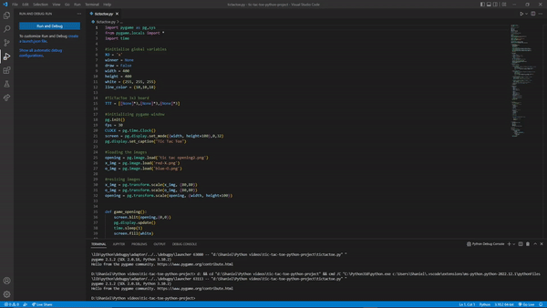

# tic-tac-toe

This is a fun warm-up project I did to get the idea of how to create a game.

Created a Tic Tac Toe using PyGame module

Important thing is need to have two PNG file for  X and O. The purpose of the PNG file is that it will be use to display every move using image.load.

The board size and image size can be adjustable.

If you have any Questions let me know.

